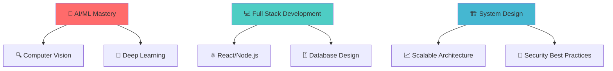

<div align="center">

# 🚀 Welcome to Allen's Digital Universe! 


<!-- DATE_START -->
📅 Last Updated: July 07, 2026
<!-- DATE_END -->


</div>

---

## 🎯 **About Me**


```typescript
const allen = {
    pronouns: "He/Him",
    location: "India 🇮🇳",
    currentFocus: "AI/ML & Computer Vision",
    learning: "Advanced Data Structures & Algorithms",
    workingOn: "Fake Social Media Profile Detection",
    funFact: "I think I'm funny 😁",
    motto: "Code today, innovate tomorrow! 🚀"
};
```

- 🔭 **Currently Building:** [AI-Powered Fake Profile Detection System](https://colab.research.google.com/drive/1BjDu2-P2jRS0Rd2J6_QfhBZ4bZnO7aNB?usp=sharing)
- 🌱 **Learning:** Advanced DSA & Full-Stack Development
- 🎯 **Goal:** Contributing to open-source AI/ML projects
- 📫 **Reach me:** [pottumkalallenjose@gmail.com](mailto:pottumkalallenjose@gmail.com)
- 📄 **Resume:** [View My Experience](https://drive.google.com/file/d/1jJ24qtpAjKalFLugtQwywCr8ASltyzv0/view?usp=sharing)

---

## 🛠️ **Tech Arsenal**

<div align="center">

### **Languages**


### **AI/ML & Data Science**


### **Web Technologies**


### **Databases & Tools**


</div>

---

## 🚀 **Featured Projects**

<div align="center">

### 🔥 **AI Computer Vision for Fake Profile Detection**
*Using advanced machine learning to identify fraudulent social media profiles*

[](https://colab.research.google.com/drive/1BjDu2-P2jRS0Rd2J6_QfhBZ4bZnO7aNB?usp=sharing)


### 📚 **Book Review Application**
*Full-stack Node.js application with JWT authentication and async operations*

[](https://github.com/allenjose24/expressBookReviews)


</div>

---

## 🌐 **Connect & Collaborate**

<div align="center">

[](https://linkedin.com/in/allen-jose)
[](https://twitter.com/allenjose2110)
[](mailto:pottumkalallenjose@gmail.com)

### **Competitive Programming Profiles**
[](https://www.leetcode.com/allenjose2424)
[](https://www.codechef.com/users/allenjose2110)
[](https://www.hackerrank.com/allenjose2110)
[](https://codeforces.com/profile/allenjose2110)
[](https://www.hackerearth.com/@allenjose2110)

</div>

---

## 📊 **GitHub Analytics**

<div align="center">


<br/>


</div>

---

## 🏆 **Achievements & Trophies**

<div align="center">

[](https://github.com/ryo-ma/github-profile-trophy)

</div>

---

## 🎯 **Current Learning Path**

<div align="center">



</div>

---

## 📈 **Activity Graph**

<div align="center">

[](https://github.com/ashutosh00710/github-readme-activity-graph)

</div>

---

## 💭 **Random Dev Quote**

<div align="center">


</div>

---

## 🎵 **Currently Jamming To**

<div align="center">

[](https://open.spotify.com/user/31k6cx2fuqt25lsnzjhkx3oqvz6m)

</div>

---

<div align="center">

### 🌟 **"Code is like humor. When you have to explain it, it's bad."** 


---

### 💖 **Thanks for visiting!** 
*Let's build something amazing together!* 🚀


</div>

